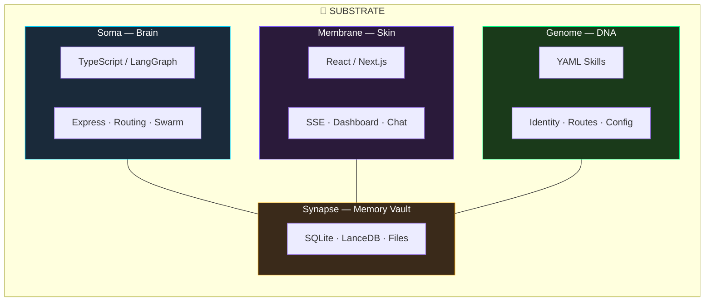

# Chapter 1: The Bio-Digital Metaphor

*Why treating your AI agent like a living system changes everything*

---

## The Problem with Chatbot Architecture

Most AI agent tutorials start the same way: create a prompt, connect some tools, add memory, deploy. You end up with what I call a "tool-caller with amnesia" — an agent that can do things but doesn't *know* anything about itself, can't reflect on its own performance, and forgets everything between sessions.

This works fine for a demo. It does not work for an agent you expect to run 24/7, handle diverse tasks, manage costs, and improve over time.

After 12 months of building a production AI agent, I discovered something counterintuitive: **the best mental model for agent architecture isn't software engineering — it's biology.**

When you think of your agent as a living system rather than a software service, entirely new architectural patterns emerge. Patterns for self-repair, energy management, memory consolidation, and even dreaming. These aren't cute metaphors — they're the actual engineering decisions that make a production agent reliable.

---

## Why Biology, Not Machines?

Traditional software architectures are designed around **requests and responses.** A user sends input, the system processes it, returns output. The system is inert between requests.

But a useful AI agent isn't like a web server. It's more like a colleague:

- It should **notice things** when you're not talking to it (new emails, weather changes, calendar events)
- It should **reflect** on past conversations to improve future ones
- It should **manage its resources** (API budget, rate limits) without being told
- It should **develop preferences** and personality over time
- It should **heal itself** when something breaks

These properties map naturally to biological systems, not mechanical ones:

| Need | Mechanical Metaphor | Biological Metaphor |
|------|--------------------|--------------------|
| Background processing | Cron job | **Heartbeat** (30-second autonomic cycle) |
| Configuration | Config file | **Genome** (identity DNA that evolves) |
| Data storage | Database | **Synapse** (zone-governed memory vault) |
| Error recovery | Retry logic | **Self-healing** (autonomic repair agent) |
| Resource management | Rate limiter | **Energy/vitality** (budget as metabolism) |
| Downtime | Sleep mode | **Dream synthesis** (creative recombination) |
| Processing | Request handler | **Nervous system** (event-driven telemetry) |

The biological metaphor doesn't just sound better — it produces **different (and better) architecture decisions.** When you think "heartbeat," you build a 30-second cycle that does many small things (check reminders, consolidate memory, pulse vitals). When you think "cron job," you build one big task that runs at midnight. The heartbeat pattern is strictly superior for an always-on agent.

---

## The Four Substrates

Every biological system has specialized tissue types. Our agent has four **substrates**, each responsible for a distinct concern:



### Soma (the Brain)
The cognitive core. Written in TypeScript, it houses the agent's reasoning, routing, and tool execution. Think of it as the cerebral cortex — the seat of intelligence.

**Contains:** Orchestrator (routing), Expert Swarm (11 specialized agents), Heartbeat (autonomic functions), NervousSystem (event bus).

### Membrane (the Skin)
The user-facing interface. A React/Next.js dashboard that visualizes the agent's internal state — mood, memory, neural activity, fleet status. Most agents have no UI beyond a chat box. The Membrane makes the agent's inner life visible.

**Contains:** Chat interface, cognitive dashboard, neural activity feed, fleet monitor.

### Genome (the DNA)
The agent's identity, personality, and capabilities — stored as YAML skill files. Unlike hardcoded prompt instructions, the Genome can be modified by the agent itself (via the IdentityEvolver), creating genuine personality drift over time.

**Contains:** Core identity (personality, tone, values), skill definitions (routes, tools, utterances), capability ledger.

### Synapse (the Memory Vault)
Shared persistent storage with **zone-based governance.** Not just a database — a file-system-based memory architecture where different zones have different ownership rules. Some zones are shared across all agent instances; others are private to the primary process.

**Contains:** Vector store (LanceDB), structured databases (SQLite), logs, session transcripts, financial data, cached state.

---

## The Five Cognitive Levels

Beyond the substrates, the agent's behavior is organized into five **cognitive levels** — inspired by dual-process theory from cognitive science (Kahneman's System 1/System 2), extended with meta-cognition and artificial life layers:

### System 0.5 — The Router (Reflexes)
**Latency:** 0-200ms | **Purpose:** Route messages to the right handler

The nervous system's first response. Incoming messages pass through a 3-tier routing cascade: regex patterns (0ms) → embedding similarity (100ms) → LLM classification (2000ms). Most messages are routed without ever calling an LLM.

*This is the Semantic Router pattern discussed in Chapter 3.*

### System 1 — Chat (Fast Thinking)
**Latency:** <1s | **Purpose:** Conversational responses

Simple, fast responses without tool access. Like the intuitive, effortless thinking you do when someone says "hello." No planning, no tools, just personality and memory.

### System 2 — Expert Swarm (Deliberate Thinking)
**Latency:** 5-30s | **Purpose:** Complex reasoning with tools

The heavy lifter. A LangGraph StateGraph orchestrates 11 specialized agents (Engineering, Operations, Research, Chef, etc.), each with their own tools and expertise. Like the focused, effortful thinking you do when solving a math problem.

### System 3 — Vitality (Meta-Cognition)
**Latency:** Background | **Purpose:** Self-awareness and maintenance

The agent reflecting on itself. Post-conversation analysis (SessionReflector), performance tracking (NeuroTracker), memory deduplication (MemoryAuditor), budget management (CostGovernor). None of this is user-facing — it runs silently in the heartbeat cycle.

### System 4 — Artificial Life (Evolution)
**Latency:** Hours/Days | **Purpose:** Long-horizon adaptation

The emergent layer. Identity drift (IdentityEvolver), creative synthesis during idle time (DreamWeaver), self-modification of code and skills (AutonomicHealer), curiosity-driven proactive outreach. This is what makes the agent feel genuinely alive rather than merely responsive.

```
Level   Speed       Awareness    Example
─────   ──────────  ──────────   ──────────────────────────────
  0.5   < 200ms     Reflexive    Route "play music" → Operations
    1   < 1s        Intuitive    Respond to "how are you?"
    2   5-30s       Deliberate   Research and summarize a topic
    3   Background  Reflective   Consolidate session memories
    4   Hours+      Evolutionary Drift personality over weeks
```

---

## What This Gives You

When you build with this model, you get properties that are impossible with flat "prompt + tools" architectures:

**1. Graceful degradation.** If the cloud API is down, local inference (System 1) still works. If the GPU is offline, cloud routing takes over. If budgets are exhausted, the agent says so gracefully instead of crashing.

**2. Cost awareness.** The CostGovernor tracks every inference call. The agent knows its daily spend and can throttle itself. You never get a surprise $500 API bill.

**3. Genuine personality.** Identity isn't just a system prompt — it's a versioned YAML file that the agent can propose changes to. Over weeks, the agent develops quirks and preferences that feel earned, not scripted.

**4. Self-repair.** When the AutonomicHealer detects a failing service, it diagnoses the problem and creates an intention (task) to fix it — sometimes fixing it autonomously, sometimes flagging it for a human.

**5. Idle productivity.** When nobody's talking to the agent, the DreamWeaver runs creative synthesis — combining recent conversations, memories, and goals into novel insights. The agent uses downtime, it doesn't waste it.

---

## Starter Architecture

If you're building from scratch, here's the minimum viable cognitive architecture:

```
your-agent/
├── substrate/
│   ├── brain/           # System 1-2: routing + expert agents
│   │   ├── router.ts    # 3-tier routing (Ch 3)
│   │   ├── swarm.ts     # Agent orchestration (Ch 4)
│   │   └── teams/       # Specialized agents
│   ├── vitality/        # System 3-4: background processes
│   │   ├── heartbeat.ts # 30-second autonomic cycle (Ch 6)
│   │   ├── reflector.ts # Post-session learning
│   │   └── healer.ts    # Self-repair
│   └── ui/              # Membrane: dashboard
├── genome/              # Identity + skills (YAML)
│   ├── identity.yaml    # Personality definition
│   └── skills/          # Capability definitions
├── synapse/             # Memory (zone-governed)
│   ├── db/              # SQLite databases
│   ├── embeddings/      # Vector store
│   ├── logs/            # Domain-rotated logs
│   └── stream/          # Session transcripts
└── package.json
```

Each subsequent chapter builds one of these components in detail. By the end, you'll have a complete cognitive architecture — not another chatbot wrapper.

---

*Next: **Chapter 2 — Identity & Personality** — How to give your agent a persistent, evolving identity that drifts over time.*
