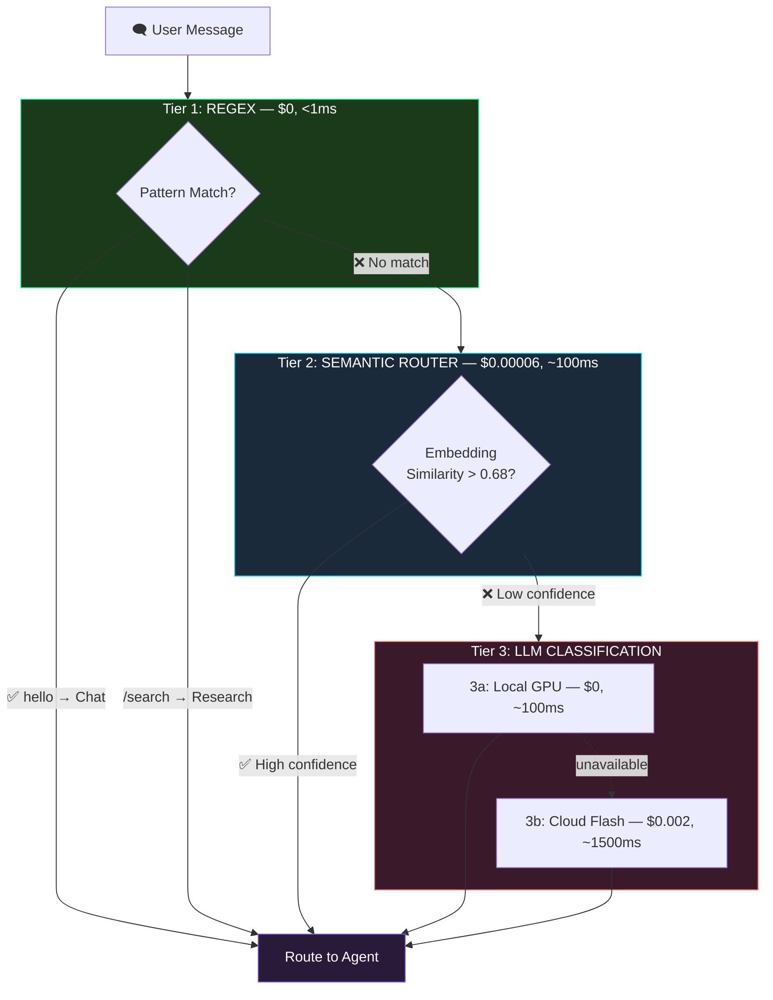

# Chapter 3: Multi-Tier Routing

*Route messages 20x faster without an LLM call*

> 📢 **This chapter is free.** If you find it useful, the full blueprint covers identity, memory, autonomics, fleet orchestration, and more at [sophialabs.gumroad.com](https://sophialabs.gumroad.com).

---

## The $0.002 Problem

Every multi-model AI agent needs to route incoming messages to the right handler. The standard approach:

```
User message → LLM call ("which agent handles this?") → route
```

This works. But for every single message, you're paying:
- **~$0.001-0.003** per classification call
- **800-3000ms** of latency before the agent even starts thinking
- **Rate limit pressure** on your API quota

At 1,000 messages/day, that's $2-3/day just for routing — before any actual work happens. And users feel the delay on every interaction.

There's a better way.

---

## The 3-Tier Cascade

Instead of one LLM call, we route through three tiers with increasing intelligence and cost:



**In practice, 85-90% of messages are caught by Tier 1 or 2.** The expensive LLM call only fires for genuinely ambiguous inputs.

---

## Tier 1: Regex (The Reflexes)

The simplest routing — pattern matching on the raw input. Think of it as the spinal reflex that pulls your hand from a hot stove before your brain processes pain.

```typescript
function regexRoute(message: string): string | null {
    const lower = message.toLowerCase().trim();

    // Greetings → Chat (no tools needed)
    if (/^(hi|hello|hey|yo|sup|good morning|good evening)\b/i.test(lower)) {
        return 'chat_expert';
    }

    // Explicit commands → Operations
    if (/^(play|pause|stop|skip|volume|next track)/i.test(lower)) {
        return 'operations_expert';
    }

    // Code-related keywords → Engineering
    if (/^(refactor|debug|fix|implement|deploy|build)\b/i.test(lower)) {
        return 'engineering_expert';
    }

    return null; // No match → fall through to Tier 2
}
```

**Why keep it?** Because `"hello"` should never cost $0.002 and 1500ms to classify. Regex routes are instant and free. They handle the obvious cases that represent ~30% of real-world interactions.

---

## Tier 2: Semantic Router (The Fast Brain)

This is the core innovation. Instead of asking an LLM "which agent handles this?", we compare the message's **embedding** against pre-computed **route embeddings**.

### How it works:

**1. At startup**, compile route definitions into embeddings:

```typescript
// Each route has example utterances
const routes = [
    {
        name: 'engineering_expert',
        utterances: [
            "help me refactor this React component",
            "debug this Python function",
            "write a unit test for the auth module",
            "what's the best way to handle errors in async code",
            // ... 47 utterances total
        ]
    },
    {
        name: 'chef_expert',
        utterances: [
            "what should I cook for dinner tonight",
            "give me a recipe for pasta carbonara",
            "how do I make sourdough bread",
            // ... 13 utterances total
        ]
    },
    // ... 11 routes, 486 utterances total
];
```

**2. Compile embeddings** for all utterances (once, then cache to disk):

```typescript
async compile(routes: Route[]) {
    for (const route of routes) {
        // Embed all utterances
        const embeddings = await embedder.embedDocuments(route.utterances);

        // Compute centroid (average) for fast pre-filtering
        const centroid = averageVectors(embeddings);

        this.compiledRoutes.push({
            name: route.name,
            centroid,
            utteranceEmbeddings: embeddings
        });
    }

    // Save to disk cache (skip compilation on next boot)
    this.saveCache();
}
```

**3. At query time**, two-phase matching:

```typescript
async route(message: string): Promise<RouteMatch | null> {
    // Phase 1: Embed the query (~80ms, cached via LRU)
    const queryEmbedding = await embedder.embedQuery(message);

    // Phase 2a: Centroid pre-filter
    // Compare query against each route's centroid (average of all utterances)
    // Keep only top-K candidates (fast elimination)
    const candidates = this.compiledRoutes
        .map(r => ({
            route: r,
            score: cosineSimilarity(queryEmbedding, r.centroid)
        }))
        .sort((a, b) => b.score - a.score)
        .slice(0, 3); // Top 3 candidates

    // Phase 2b: Fine-grained matching against individual utterances
    let bestMatch = null;
    let bestScore = 0;

    for (const candidate of candidates) {
        for (const utteranceEmb of candidate.route.utteranceEmbeddings) {
            const score = cosineSimilarity(queryEmbedding, utteranceEmb);
            if (score > bestScore) {
                bestScore = score;
                bestMatch = candidate.route.name;
            }
        }
    }

    // Confidence thresholds
    if (bestScore > 0.82) return { route: bestMatch, confidence: 'high' };
    if (bestScore > 0.68) return { route: bestMatch, confidence: 'medium' };
    return null; // Below threshold → fall through to Tier 3
}
```

### Why two-phase?

With 486 utterances across 11 routes, naive brute-force means 486 cosine similarity computations per query. The centroid pre-filter reduces this to ~3×40 = ~120 comparisons (top 3 routes × ~40 utterances each), cutting computation by 75%.

### Why this is fast:

| Operation | Time |
|-----------|------|
| Embed query (API call) | ~80ms |
| Cosine similarity (486 comparisons) | ~2ms |
| **Total** | **~82ms** |

Compare to an LLM classification call: **~1500-3000ms**. That's a 15-30x speedup.

---

## Tier 3: LLM Fallback (The Slow Brain)

When embedding similarity is too low (the message is genuinely ambiguous), fall back to an LLM:

```typescript
async llmClassify(message: string): Promise<string> {
    // Try local GPU first (free, ~100ms)
    if (isOllamaAvailable()) {
        try {
            return await localModel.classify(message);
        } catch { /* fall through to cloud */ }
    }

    // Cloud fallback (~1500ms, ~$0.002)
    const decision = await classificationChain.invoke({
        input: message,
        agents: routeDescriptions,
    });

    return decision.destination;
}
```

**Local-first routing** means even the "expensive" Tier 3 is free when your local GPU is available.

---

## The Shadow Comparison Pattern

Here's an architectural detail most routing systems miss: **shadow comparison.**

When Tier 3 routes a message, we also check what Tier 2 *would have* chosen:

```typescript
// Log routing decisions for analysis
const semanticChoice = await semanticRouter.route(message);  // Already computed
const llmChoice = await llmClassify(message);                // Just computed

if (semanticChoice?.route !== llmChoice) {
    logger.warn(`[ROUTING] Disagreement: Semantic=${semanticChoice?.route}, LLM=${llmChoice}`);
    // This is a training signal — the route may need more utterances
}
```

Over time, this surface inconsistencies: routes that need more utterances, ambiguous messages that both routers struggle with, or LLM classification errors. You can then add utterances to improve Tier 2 coverage, reducing future LLM fallbacks.

---

## Skill-Driven Route Definition

Routes shouldn't be defined in code. They should be defined alongside the agents they route to — in the **skill files**:

```yaml
# genome/skills/engineering-persona/skill.yaml
name: engineering-persona
route: engineering_expert
description: "Code generation, refactoring, debugging, and technical architecture"
utterances:
  - "help me refactor this component"
  - "debug this function"
  - "write a unit test"
  - "what's the best architecture for..."
  # ... 47 utterances
```

At boot, the system discovers all skills, extracts their routes and utterances, and feeds them to the SemanticRouter. **Adding a new agent is just creating a new skill YAML** — no code changes needed.

---

## Cost Comparison

For an agent handling 1,000 messages/day:

| Approach | Daily Cost | Avg Latency |
|----------|-----------|-------------|
| LLM-only routing | $2-3/day | ~1,500ms |
| 3-Tier Cascade | ~$0.10/day | ~120ms avg |
| **Savings** | **~$2.90/day ($87/mo)** | **12x faster** |

The savings compound. At 10,000 messages/day, you're saving $870/month on routing alone.

---

## Implementation Checklist

To implement this in your own agent:

1. **Define routes as YAML** alongside each agent/skill
2. **Compile utterance embeddings** at startup (cache to disk)
3. **Build the 3-tier cascade**: regex → cosine similarity → LLM
4. **Add confidence thresholds** (high >0.82, medium >0.68)
5. **Enable shadow comparison** to find weak routes
6. **LRU cache** query embeddings (same question = instant re-route)
7. **Track routing decisions** for continuous improvement

---

*This is one chapter from the full blueprint. The complete guide covers identity evolution, memory architecture, autonomic systems, fleet orchestration, and more → [sophialabs.gumroad.com](https://sophialabs.gumroad.com)*

---

*Next: **Chapter 4 — Expert Swarm Architecture** — How to build an 11-agent team that collaborates.*
