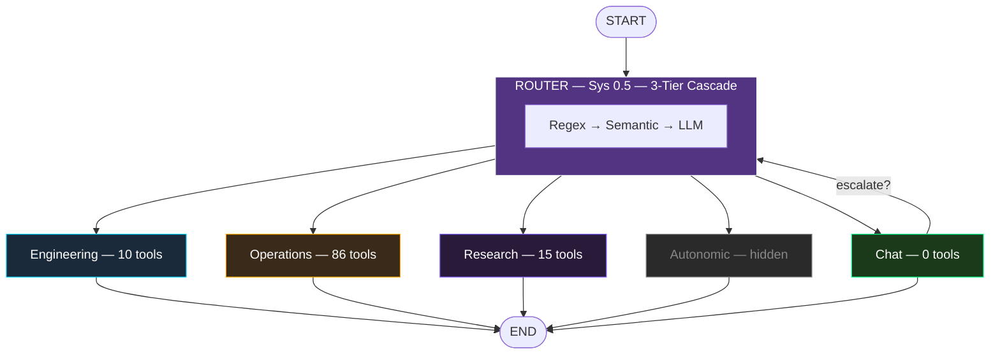

# Chapter 4: Expert Swarm Architecture

*How to build an 11-agent team that collaborates*

---

## Why Not One Big Agent?

The simplest AI agent architecture: one model, all tools, one system prompt. It works until you hit three walls:

1. **Context pollution.** 86 tool definitions in one prompt dilute the model's attention. The agent starts calling the wrong tools.
2. **Cost explosion.** Every message sends 86 tool schemas to the API. That's ~4,000 tokens of overhead per call.
3. **Personality collapse.** An agent that writes code, cooks dinner, and plays music can't maintain a coherent personality across domains.

The solution: **specialized agents** that each own a narrow domain, orchestrated by a shared graph.

---

## The StateGraph Pattern

We use LangGraph's `StateGraph` to build a directed graph where each node is an agent and edges represent routing decisions:

```typescript
import { StateGraph, END, START } from "@langchain/langgraph";

// Shared state: messages flow through the graph
const channels = {
    messages: {
        value: (x, y) => x.concat(y),  // Accumulate messages
        default: () => []
    },
    next: {
        value: (x, y) => y,            // Latest routing decision
        default: () => END
    }
};

const workflow = new StateGraph({ channels })
    .addNode("router", orchestratorNode)     // Entry: routes to experts
    .addNode("engineering", engineeringAgent)
    .addNode("operations", operationsAgent)
    .addNode("research", researchAgent)
    .addNode("chat", chatAgent)
    // ... 11 agents total

    .addEdge(START, "router")               // Always start at router
    .addConditionalEdges("router", routingFn, edgeMap)
    .addEdge("engineering", END)            // Single-shot: expert → done
    .addEdge("operations", END)
    .addEdge("research", END);

const agent = workflow.compile();
```

**Key insight:** Agents are **single-shot.** The router picks one expert, that expert responds, turn over. No multi-hop chains of agents calling agents (that's where runaway graphs live). The one exception is Chat's escalation gate (covered below).

---

## The Agent Registry

Instead of hardcoding agents in the graph builder, we use a **declarative registry** — a single array that is the source of truth:

```typescript
// agent_registry.ts
interface AgentRegistryEntry {
    name: SwarmAgentName;        // Enum value (graph node ID)
    displayName: string;         // Human-readable label
    factory: (ctx) => Promise<any>;  // Lazy instantiation
}

const AGENT_REGISTRY: AgentRegistryEntry[] = [
    {
        name: SwarmAgentName.ENGINEERING,
        displayName: 'Engineering',
        factory: async (ctx) => {
            const { createEngineeringAgent } = await import('../teams/engineering');
            return createEngineeringAgent(ctx);
        }
    },
    {
        name: SwarmAgentName.OPERATIONS,
        displayName: 'Operations',
        factory: async (ctx) => {
            const { createOperationsAgent } = await import('../teams/operations');
            return createOperationsAgent(ctx);
        }
    },
    // ... 11 entries total
];
```

**Why a registry?** Adding a new agent becomes a 3-step checklist:
1. Add an enum value to `SwarmAgentName`
2. Add one entry to `AGENT_REGISTRY`
3. Create the agent file in `teams/`

The graph builder loops over the registry to add nodes, edges, and Zod routing enums automatically. Zero graph code changes.

**Why lazy factories?** Each agent imports its own dependencies (tools, models, prompts). Lazy `import()` means agents that aren't routed to don't load their dependencies — faster boot, no circular imports.

---

## Access Control: Not Every Agent Needs Every Tool

This is where most multi-agent tutorials go wrong. They give every agent access to every tool. In practice, you want strict **tool access control:**

| Agent | Tools | Why |
|-------|-------|-----|
| **Chat** | 0 | Pure conversation — tools would slow it down |
| **Engineering** | ~10 | File ops, git, code execution only |
| **Operations** | ~86 | Everything — OS, music, finance, smart home |
| **Research** | ~15 | Web search, browser automation |
| **Chef** | Subset | Recipe search, no file ops |
| **Healer** | ~4 | Log reading, service restart only |

```typescript
// teams/engineering.ts
export async function createEngineeringAgent(context) {
    // Only gets file + git tools
    const tools = [
        new ReadFileTool(),
        new WriteFileTool(),
        new ListDirTool(),
        new CreateBranchTool(),
        new CommitTool(),
        new CreatePRTool(),
        new RunSandboxTool(),
    ];

    return createReactAgent({
        llm: getSmartModel(),
        tools,
        messageModifier: engineeringSystemPrompt(context),
    });
}
```

**Operations** is the exception — it gets **dynamic MCP tools** that refresh every turn:

```typescript
// teams/operations.ts
export async function createOperationsAgent(context) {
    return async (state) => {
        // Refresh tool list EVERY turn (MCP servers may have added/removed tools)
        const mcpTools = await serviceRegistry.getAllTools();
        const allTools = [...staticTools, ...mcpTools];

        const agent = createReactAgent({
            llm: getSmartModel(),
            tools: allTools,
            messageModifier: operationsPrompt(context),
        });

        return agent.invoke(state);
    };
}
```

This means if you connect a new MCP server (say, Home Assistant), Operations automatically gets access to its tools on the next message — no restart needed.

---

## The Chat Escalation Pattern

Chat is the fastest agent (no tools, smallest model). But sometimes a "simple" message actually needs tools:

> *"Can you play some jazz?"*

Chat can't play music (no tools). Instead of failing, it **escalates:**

```typescript
// teams/chat.ts
async function chatAgent(state) {
    const response = await chatModel.invoke(state.messages);

    // Detect if response needs tools chat doesn't have
    if (needsEscalation(response)) {
        return {
            messages: [new AIMessage(`[ESCALATED:operations] ${response.content}`)],
            next: "router"  // Re-enter the routing graph
        };
    }

    return { messages: [response], next: END };
}
```

The `[ESCALATED:operations]` signal tells the router to re-route to Operations. This happens at most **once** (hard limit prevents loops):

```typescript
const MAX_SWARM_ESCALATIONS = 1;
let escalationCount = 0;

workflow.addConditionalEdges("chat", (state) => {
    const last = state.messages[state.messages.length - 1];
    if (last?.content.startsWith('[ESCALATED:') && escalationCount < MAX_SWARM_ESCALATIONS) {
        escalationCount++;
        return "router";  // Re-route
    }
    return END;
});
```

**Why this pattern?** Most messages go to Chat (fast, cheap). Only messages that *actually* need tools get escalated to heavier agents. This saves cost without sacrificing capability.

---

## The Synthesis Agent: Decompose → Delegate → Merge

Some queries span multiple domains: *"Research the latest AI news and write a blog post about it."*

The **Synthesis agent** handles these by decomposing the query, reasoning about each part, and merging results:

```typescript
// teams/synthesis.ts — simplified
async function synthesisAgent(state) {
    const response = await smartModel.invoke([
        new SystemMessage(`You are a multi-domain synthesizer.
When a query spans multiple areas:
1. DECOMPOSE into sub-questions
2. REASON about each using your knowledge
3. MERGE into a unified response

You have NO tools — only reasoning.`),
        ...state.messages
    ]);

    return { messages: [response] };
}
```

**Key design decision:** Synthesis has **zero tools.** It's pure reasoning. It doesn't delegate to other agents (that would create multi-hop chains). Instead, it uses the model's own knowledge to address cross-domain queries. This keeps the graph acyclic and prevents runaway inference.

---

## Adding a New Agent: 3-Step Checklist

Let's say you want to add a `Finance` agent:

### Step 1: Add the enum
```typescript
// types/enums.ts
enum SwarmAgentName {
    ENGINEERING = 'engineering_expert',
    // ...
    FINANCE = 'finance_expert',  // NEW
}
```

### Step 2: Register it
```typescript
// agent_registry.ts
{
    name: SwarmAgentName.FINANCE,
    displayName: 'Finance',
    factory: async (ctx) => {
        const { createFinanceAgent } = await import('../teams/finance');
        return createFinanceAgent(ctx);
    }
}
```

### Step 3: Create the agent
```typescript
// teams/finance.ts
export async function createFinanceAgent(context) {
    const tools = [new BudgetTool(), new InvoiceTool()];
    return createReactAgent({
        llm: getSmartModel(),
        tools,
        messageModifier: `You are a financial analyst. ${context.identity}`,
    });
}
```

### Step 4 (optional): Add routing utterances
```yaml
# genome/skills/finance-persona/skill.yaml
route: finance_expert
utterances:
  - "what's my budget this month"
  - "create an invoice for"
  - "how much did I spend on"
```

That's it. The graph builder picks up the new agent automatically. The Semantic Router learns to route to it from the utterances. No graph code changes.

---

## Architecture Diagram



---

*Next: **Chapter 5 — Memory Architecture** — Zone-governed shared memory that scales.*
