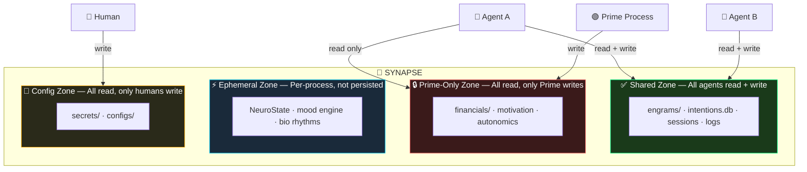

# Chapter 5: Memory Architecture

*Zone-governed shared memory that scales*

---

## The Memory Problem

Most AI agents store memory in one of two ways:
1. **In-context** — stuff everything into the system prompt (runs out of space)
2. **Single database** — dump everything into one vector store (becomes a swamp)

Both fail at scale. In-context memory hits token limits. Single-database memory loses structure — the agent can't distinguish between "things I learned" vs "tasks I'm tracking" vs "conversations I had."

A production agent needs **structured, governed memory** — different types of data with different ownership rules, persistence guarantees, and access patterns.

---

## The Synapse: Memory as Filesystem

Instead of a single database, our memory architecture uses a **governed filesystem** called the Synapse:

```
synapse/                          ← The One Mind
├── db/                           ← Structured databases
│   ├── intentions.db             ← Active backlog (SQLite, WAL mode)
│   ├── data_vault.db             ← Long-term memory store
│   ├── fleet.db                  ← Cross-process sync
│   ├── telemetry.db              ← Cost/performance tracking
│   └── sys_traces.db             ← Inference traces
├── embeddings/                   ← Vector store (LanceDB)
├── engrams/                      ← Discrete memory units (markdown)
├── stream/                       ← Session transcripts
├── logs/                         ← Domain-rotated logs
├── financials/                   ← Budget and cost data
├── config/                       ← Runtime configuration
└── secrets/                      ← API keys, credentials
```

**Why filesystem over a monolithic database?**

1. **Git-friendly.** Markdown engrams and YAML configs are version-tracked. You can see exactly when a memory was created or modified.
2. **Inspectable.** You can `cat` any memory. No need for a query tool to debug.
3. **Zone-governable.** File permissions and directory ownership map naturally to access control.
4. **Portable.** Copy the `synapse/` directory to another machine and the agent boots with full memory.

---

## The Four Zones

Not all memory has the same ownership semantics. The Synapse is divided into **four zones:**



### Why zones matter

Without zones, a background worker might overwrite financial data mid-calculation, or a dev agent might corrupt the motivation engine's state. Zones prevent this:

- **Shared:** Safe for concurrent access. SQLite WAL mode, unique IDs for file writes.
- **Prime-Only:** Only the primary process (heartbeat, autonomics) writes here. Workers read for context.
- **Ephemeral:** In-memory state (mood, energy) that dies with the process.
- **Config:** Human-managed. The agent reads but never modifies its own secrets or configs.

---

## Vector Memory: Engrams

An **engram** is a discrete unit of long-term memory — a lesson learned, a fact discovered, a preference observed:

```typescript
// Creating an engram
await createEngram({
    content: "User prefers concise responses before 9am",
    title: "Morning Communication Preference",
    tags: ["user-preference", "communication", "temporal"],
    subtype: "lesson"
});
```

Engrams are stored two ways:
1. **Markdown files** in `synapse/engrams/` — human-readable, git-tracked
2. **Vector embeddings** in LanceDB (`synapse/embeddings/`) — semantically searchable

```typescript
// Semantic memory search
const memories = await searchMemory("how does the user like to be greeted");
// Returns: engrams ranked by embedding similarity
// [{ content: "User prefers concise responses before 9am", score: 0.87 }]
```

### Why both files AND vectors?

Files give you persistence, auditability, and git history. Vectors give you semantic search ("find memories similar to X"). You need both — files are the source of truth, vectors are the index.

---

## Active Working Memory: Intentions

While engrams are *passive* knowledge, **intentions** are *active* tasks — the agent's working memory:

```typescript
// The agent creates its own tasks
await createIntention({
    title: "Research competitor pricing for blueprint",
    description: "Check Gumroad for similar AI architecture guides",
    priority: "high",
    tags: ["marketing", "research"],
    type: "task"
});

// List what's on the agent's mind
const openTasks = await listIntentions('open');
// Returns: all active intentions sorted by priority

// Close a completed task
await updateIntention(id, {
    status: 'done',
    closure: { reason: "Completed. Found 3 competitors, none matching our depth." }
});
```

**Critical pattern: Structured Closure.** When marking an intention done, we *append* a closure section rather than overwriting the description. This preserves the original intent alongside the outcome:

```markdown
## Original Intent
Research competitor pricing for blueprint

## Closure (2026-03-04)
Completed. Found 3 competitors, none matching our depth.
Cheapest: $29 (10 pages, no code). Most expensive: $199 (video course).
Our $49-79 range is competitive for the depth offered.
```

---

## The Fleet Bridge Pattern

When multiple agents share the same Synapse, ephemeral state (mood, energy) needs to be synchronized. The **Fleet Bridge** uses `fleet.db` metadata:

```
Primary Process                   fleet.db                    Worker Process
─────────────────                 ────────                    ──────────────
MoodEngine: "Focused"     →      metadata: {              →  Read metadata
VitalStats: energy=0.72           mood: "Focused",            Set local state
PulseFleet every 30s              energy: 0.72,               mood = "Focused"
                                  curiosity: 90,              energy = 0.72
                                }
```

Rules:
1. Only Primary computes mood/energy — workers inherit, never compute competing values
2. Keep metadata compact (<500 bytes)
3. Graceful degradation — if metadata is missing, use sensible defaults
4. SQLite WAL mode enables concurrent reads during writes

---

## Building Your Own Synapse

Minimum viable implementation:

### 1. Create the directory structure
```bash
mkdir -p synapse/{db,engrams,embeddings,logs,stream,config}
```

### 2. Initialize the vector store
```typescript
import { LanceDB } from "@langchain/community/vectorstores/lancedb";

const vectorStore = await LanceDB.fromDocuments(
    [],  // Empty initial store
    embeddingModel,
    { tableName: "engrams", uri: "synapse/embeddings" }
);
```

### 3. Define zone guards
```typescript
const PRIME_ONLY_PATHS = ['financials/', 'motivation_', 'autonomous_', 'reaper_'];

function assertWriteAllowed(filePath: string, agentRole: string) {
    if (agentRole !== 'prime') {
        const isPrimeOnly = PRIME_ONLY_PATHS.some(p => filePath.includes(p));
        if (isPrimeOnly) {
            throw new Error(`Zone violation: ${agentRole} cannot write to Prime-Only path: ${filePath}`);
        }
    }
}
```

### 4. Wire up engram creation with dual storage
```typescript
async function createEngram(data: { content: string, title: string, tags: string[] }) {
    // 1. Write markdown file (source of truth)
    const filename = `engram-${Date.now()}.md`;
    fs.writeFileSync(`synapse/engrams/${filename}`, formatEngram(data));

    // 2. Add to vector store (semantic index)
    await vectorStore.addDocuments([{
        pageContent: data.content,
        metadata: { title: data.title, tags: data.tags, file: filename }
    }]);
}
```

---

*Next: **Chapter 6 — Autonomic Systems** — Background processes that make your agent self-maintaining.*
